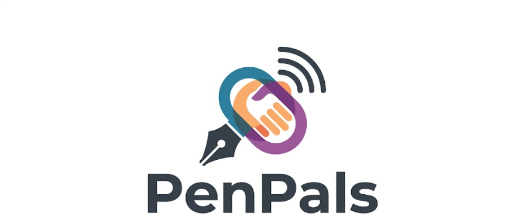

<div align="center">
  
  <h1>PenPals</h1>
  <p><strong>A secure, real-time collaborative document editor for modern teams.</strong></p>
</div>

<br />

## What is PenPals?

**PenPals** is a powerful, real-time collaborative rich-text and markdown editor. Built for modern teams, it enables multiple users to join secure edit rooms, see live cursors in real-time, communicate via integrated chat, and manage document lifecycles with local backups and cross-format exports. 

---

## The Problem It Counters

**The Problem:**
Traditional document editors are either entirely offline (creating a nightmare for team collaboration and version control) or heavily tied to locked-down corporate ecosystems (like Google Docs or Office 365) which require account sign-ups, track user data, and limit custom aesthetic experiences.

**The Solution:**
PenPals provides instant, friction-free collaboration. No accounts required. Just create a room, share the ID, and start typing. It utilizes **Conflict-free Replicated Data Types (CRDTs)** via Yjs to guarantee that everyone's keystrokes are synchronized with zero conflicts, even on unstable network connections. It marries the speed of a local editor with the power of enterprise collaboration tools.

---

## Core Features

### Real-Time Engine
*   **Live Cursors:** See exactly where your team members are typing in real-time.
*   **Integrated Chat:** A built-in sliding chat drawer to discuss changes without leaving the document.

### Security & Access Control
*   **Room Ownership:** The creator of a room is automatically assigned as the Room Owner.
*   **Moderation:** Owners can instantly revoke editing privileges from specific disruptive users or lock the entire document.

### Editing & Formatting
*   **Rich Text & Slash Commands:** Fast, native toolbar with `/` shortcut commands for inserting code blocks, quotes, and lists.
*   **Image Resizer:** Native, on-the-fly image resizing and deletion via intuitive corner drag-handles.
*   **File Interoperability:** 
    *   **Import:** Easily import Microsoft Word (`.doc`, `.docx`) and Google Docs files to continue editing.
    *   **Export:** Unified export menu to instantly save your work as PDF, Word, or Google Docs natively to your device using modern File System Access APIs.
*   **Version Backups:** Name and capture point-in-time snapshots of your document to restore later.

---

## Tech Stack

**Frontend (Client)**
*   **Framework:** Next.js 14 (App Router)
*   **Styling:** Tailwind CSS & Vanilla CSS
*   **Animations:** Framer Motion
*   **Editor:** Quill / React-Quill
*   **Real-time:** Socket.io-client, Yjs, y-quill

**Backend (Server)**
*   **Runtime:** Node.js
*   **API/Server:** Express.js
*   **WebSockets:** Socket.io, `y-websocket`
*   **Database:** MongoDB Atlas (Mongoose) with LevelDB local fallback caching
*   **Security:** Helmet, Express Rate Limit, Mongo Sanitize

---

## Installation & Local Setup

### 1. Clone the Repository
```bash
git clone https://github.com/YOUR_USERNAME/YOUR_REPO_NAME.git
cd PenPals
```

### 2. Start the Backend
Navigate to the backend folder to install dependencies and start the WebSocket/API server.
```bash
cd backend
npm install
npm run dev
```

### 3. Start the Frontend
Open a new terminal window, navigate to the frontend folder, and boot up the Next.js application.
```bash
cd frontend
npm install
npm run dev
```

